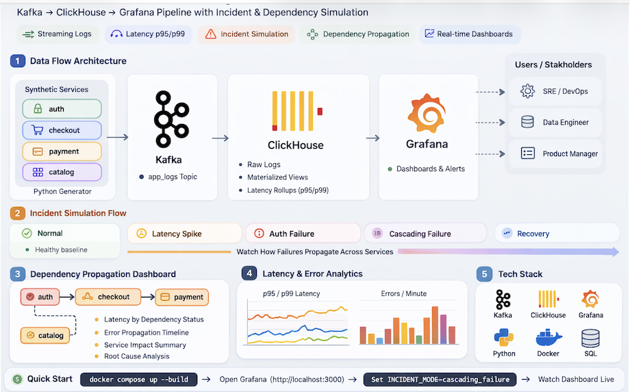

# ClickHouse Observability Demo

<p align="center">
  
</p>

**Architecture Overview**

Synthetic microservice logs are generated and streamed through Kafka into ClickHouse for analytical processing.  
Latency rollups and incident simulations are visualized through Grafana dashboards.

A self-contained **streaming observability pipeline demo** showing how modern telemetry systems are built using:

- **Kafka** — streaming ingestion
- **ClickHouse** — high-performance analytics
- **Grafana** — observability dashboards
- **Python synthetic log generator** — simulated microservice telemetry

The project models how production observability systems ingest logs, compute latency metrics, simulate incidents, and visualize system health in real time.

---

# 30-Second Demo

Run the entire observability stack locally.

```bash
git clone https://github.com/cstanca1/ch-observability.git
cd ch-observability
docker compose up --build
```

Open Grafana:

```
http://localhost:3000
```

Login:

```
admin / admin
```

You will immediately see:

- Service health dashboards
- Incident simulation
- Error analytics
- Latency metrics
- p95/p99 rollups

---

# What This Demo Demonstrates

This repository models core observability patterns used in real systems:

- Streaming log ingestion
- Microservice telemetry simulation
- Incident simulation
- Cascading service failures
- ClickHouse analytics
- Grafana observability dashboards
- Percentile latency metrics (p95 / p99)
- Materialized views and rollups

---

# Architecture

```
Synthetic Services
(Log Generator)
        │
        ▼
      Kafka
  Streaming Logs
        │
        ▼
ClickHouse Kafka Engine
        │
        ▼
Materialized View
        │
        ▼
ClickHouse Logs Table
        │
        ▼
Latency Rollups (p95 / p99)
        │
        ▼
     Grafana
Observability Dashboards
```

---

# Repository Structure

```
ch-observability
│
├── docker-compose.yml
│
├── generator
│   ├── generator.py
│   ├── Dockerfile
│   └── requirements.txt
│
├── kafka
│   └── init-topics.sh
│
├── clickhouse
│   ├── 01_logs_table.sql
│   ├── 02_kafka_engine.sql
│   ├── 03_materialized_view.sql
│   ├── 04_latency_rollup.sql
│   └── 05_latency_rollup_mv.sql
│
├── grafana
│   ├── provisioning
│   │   ├── datasources
│   │   └── dashboards
│   └── dashboards
│
└── Makefile
```

---

# Requirements

Install:

- Docker Desktop
- Docker Compose
- Git

Verify installation:

```
docker version
docker compose version
```

---

# Starting the Environment

Clone the repository.

```bash
git clone https://github.com/cstanca1/ch-observability.git
cd ch-observability
```

Start the stack.

```bash
docker compose up --build
```

---

# Services Started

The following containers run:

```
zookeeper
kafka
kafka-init
clickhouse
grafana
generator
```

---

# Accessing the Services

## Grafana

```
http://localhost:3000
```

Credentials:

```
admin / admin
```

---

## ClickHouse HTTP Interface

```
http://localhost:8123
```

---

# Observability Dashboards

Grafana dashboards are **automatically provisioned**.

Included dashboards:

### Service Health

Displays:

- event throughput
- latency metrics
- error counts
- service traffic

---

### Incident Timeline

Shows:

- errors per minute
- latency spikes
- incident progression

---

### Error Analysis

Displays:

- errors by service
- HTTP status codes
- top error combinations

---

# Synthetic Log Generator

The generator simulates microservice telemetry.

Each event contains:

```
timestamp
service
log level
latency
status code
incident mode
dependency status
```

Example event:

```json
{
  "ts": "2026-03-07T21:10:11.223",
  "service": "checkout",
  "level": "INFO",
  "latency_ms": 231.4,
  "status_code": 200,
  "incident_mode": "normal"
}
```

---

# Incident Simulation

The generator supports simulated incidents controlled by:

```
INCIDENT_MODE
```

Available modes:

```
normal
latency_spike
auth_failure
recovery
cascading_failure
```

---

## Normal Mode

Healthy system behavior.

- balanced traffic
- low error rates
- stable latency

---

## Latency Spike

Simulates a performance incident affecting **checkout**.

- increased latency
- increased error rate
- degraded service performance

---

## Auth Failure

Simulates authentication problems affecting **auth**.

Typical errors:

```
401
403
429
500
```

---

## Recovery

Simulates partial system recovery.

- latency improves
- error rates decline

---

## Cascading Failure

Simulates dependency failures across services.

Dependency chain:

```
auth → checkout → payment
```

Behavior:

- auth becomes unstable
- checkout slows down due to auth dependency
- payment degrades due to checkout failures
- catalog experiences minor pressure

This models real distributed-system incidents.

---

# Verifying the Pipeline

### Generator logs

```
docker compose logs -f generator
```

---

### Kafka topic creation

```
docker compose logs kafka-init
```

Expected:

```
Kafka topic app_logs created
```

---

### ClickHouse ingestion

```
docker compose exec clickhouse clickhouse-client \
  --user default --password clickhouse \
  --query "SELECT count() FROM logs"
```

The row count should continuously increase.

---

# Latency Rollups (p95 / p99)

The system includes **ClickHouse rollups** that compute latency percentiles.

Rollups allow dashboards to query aggregated metrics instead of raw logs.

Implemented using:

- AggregatingMergeTree
- Materialized Views
- quantileState / quantileMerge

---

# Rollup Architecture

```
Raw Logs
   │
   ▼
Materialized View
   │
   ▼
Latency Rollup Table
   │
   ▼
Grafana Percentile Metrics
```

---

# Verify Rollup Tables

```
docker compose exec clickhouse clickhouse-client \
  --user default --password clickhouse \
  --query "SHOW TABLES"
```

Expected tables:

```
latency_rollup_1m
latency_rollup_1m_mv
```

---

# Example Rollup Query

```sql
SELECT
  service,
  incident_mode,
  round(quantileMerge(0.95)(p95_latency_state),2) AS p95_latency_ms,
  round(quantileMerge(0.99)(p99_latency_state),2) AS p99_latency_ms
FROM latency_rollup_1m
WHERE minute >= toStartOfMinute(now()) - INTERVAL 5 MINUTE
GROUP BY service, incident_mode
ORDER BY p99_latency_ms DESC
```

Example output:

```
service    incident_mode   p95_latency_ms   p99_latency_ms
checkout   latency_spike   420              810
auth       auth_failure    210              330
catalog    normal          120              180
```

---

# Useful Commands

Start environment

```
docker compose up --build -d
```

Stop environment

```
docker compose down
```

Reset environment

```
docker compose down -v
docker compose up --build -d
```

Follow logs

```
docker compose logs -f
```

---

# Makefile Commands

Convenience commands:

Start demo

```
make demo
```

Reset environment

```
make reset
```

Check rollups

```
make rollups
```

View logs

```
make logs
```

---

# What This Demo Models

This architecture reflects patterns used in real observability platforms such as:

- Datadog
- New Relic
- Elastic
- Honeycomb
- Snowflake Observability workloads

Key concepts demonstrated:

- streaming ingestion
- real-time analytics
- percentile latency metrics
- incident simulation
- distributed system failure propagation

---

# Next Steps

Potential improvements:

### Cascading Failure Visualization

Grafana dashboard showing dependency impact across services.

### Service Dependency Graph

Visualize service topology.

### Time-Series Dashboards

Use rollup tables for time-series panels.

### Traffic Burst Simulation

Simulate large traffic spikes.

### OpenTelemetry Integration

Replace synthetic generator with OTEL telemetry.

### Distributed Tracing

Add trace IDs and spans.

### ClickHouse Cluster Mode

Run multi-node ClickHouse.

---

# License

MIT